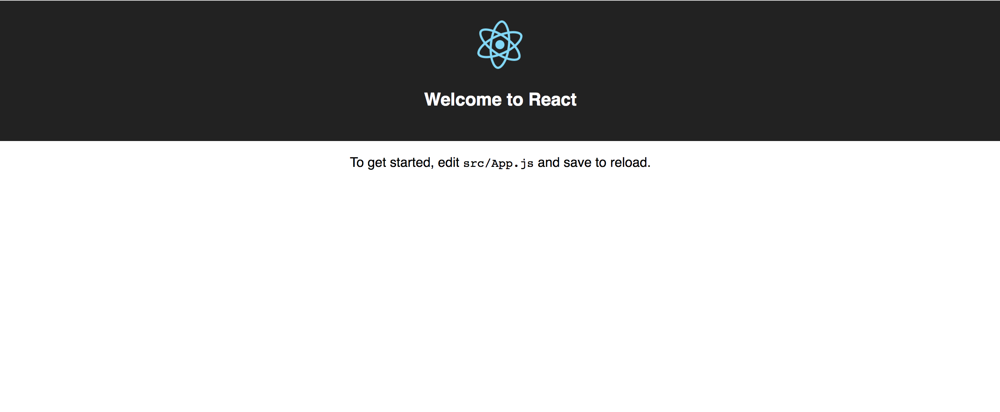

# Introduccion

Siempre es emocionante iniciar la creacion de algo nuevo. El oficio de la programación de aplicaciones web tiene estas dos particularidades: emocionante y frustrante. Emocionante por cuanto cada vez que escribimos lineas de código para crear una característica y logramos que funcione y haga lo que esperábamos, sentimos una oleada de gratificación refrescante; sin embargo, las frustraciones siempre estarán a la vuelta de la esquina.

En toda mi experiencia personal de aprendizaje en este campo me he dado cuenta que aquellos recursos didácticos que resultaron más efectivos para mi se caracterizaban por una metodología de inicio cero. En otras palabras, que todo se construía a partir de nada, que nada se asumía. Cada vez que buscaba un tutorial o un blog que explicara cómo hacer o construir algo, prefería aquellos recursos que empezaban con el título en inglés: "from scratch", es decir, desde cero.

Quizás esa no sea el caso para todo el mundo, ya que cada quien tiene sus propias preferencias sobre la mejor forma para aprender algo. En todo caso, considero que, en general, siempre es preferible dar la oportunidad de entener plenamente algo desde sus fundamentos básicos.

# Qué vamos a construir


<blockquote>
React.js es una libreria creada por Facebook para la creacion de interfaces de usuarios interactivas, basada en componentes. 
</blockquote>


Vamos a crear una aplicación web, utilizando como base para la **UI (User Interface)** la cada vez más pupular libreria **[React.js][react]**, [Mapbox][mapbox] y [styled-components][styled]. Vamos a requerir un entorno de desarrollo con [Node.js][node].

##Paso Uno: verificar la instalación de Node.js

Node.js es una plataforma de entorno de desarrollo de servidor para ejecutar Javascript. Esta aplicación demo no va a tener un componente servidor, pero sí vamos a utilizar el manejador de paquetes [yarn][yarn]. Asi que primero nos dirigimos al sitio web de [Node][node] y seguimos las instrucciones para descarga e instalacion de Node.js. Para verificar la instalacion de Node.js, en la linea de comandos, ejecutamos:

```js
    node -v
```
y el resultado debe ser algo asi como:
```js
    v8.11.1
```

##Paso Dos:Instalar yarn (opcional).

Ahora nos dirigimos al sition web de [yarn][yarn]. Existen varias formas de instalar yarn en las diferentes plataformas y sistemas. Incluso, segun el blog [https://datyayu.xyz/blog/posts/yarn], es posible instalar yarn mediante npm (que se instala por defecto una vez instalado Node.js). En caso que se prefierea usar [npm[npm]] en lugar de yarn, no es necesario seguir este paso.

Confirmamos la instalacion de yarn:
```js
    yarn -v
```
.. y el resultado deberia ser algo asi:
```shell
    1.7.0
```

##Paso Tres: Iniciar la carpeta del proyecto

Creamoso una carpeta o directorio particular y dentro de ella generamos los archivos necesarios para la configuracion inicial:

```shell
    mkdir demo
    cd demo
    demo>yarn create react-app client
```
Este último procedimiento creará los archivos en la subcarpeta **client** Esta es la estrategia preferida para inicar rápidamente a escribir código en una aplicacion React.  Comprobamos que todo esta bien ejecutando el servidor de pruebas mediante:
```shell
    cd client
    yarn start
```
Se debe abrir el navegador por defecto en nuestro sistema, en la direccion **localhost:3000**:
<div class="imagen">

<div> 

Luego, en nuestro editor de código favorito, abrimos la carpeta de proyecto **client**. 

##Paso Cuatro: instalar las dependencias necesarias
Empezamos por instalar las siguientes dependencias:

###[styled-components][styled]
Styled-components es una dependencia que une el uso de plantillas literales en Javascript y el poder de CSS para crear y adjuntar los estilos a los componentes React. Esta es una de las muchas alternativas que hay para incorporar directamente propiedades CSS en los archivos Javascript, tendencia conocida como CSS-in-JS. Styled-components es de las más populares y utilizadas. Personalmente, es mi opción preferida.

```js
    yarn add styled-components
```
###[Mapbox][mapbox]
Mapbox, una impresionante libreria para implementar mapas dinámicos en aplicaciones web y móviles. Cuenta con una implementacion para React Native también. Mapbox es comercial, y no es barata, pero posee una capa gratuita que puede emplearse para el desarrollo de aplicaciones demo, públicas o prototipos.

```js
    yarn add react-mapbox-gl mapbox-gl
```
De esta forma instalamos dos dependencias que se requieren para implementar Mapbox. A continuacion, deberemos dirigirnos al sitio web de [Mapbox][mapbox] para crear una cuenta de usuario que nos permita utilizar un token gratuito de prueba.

##paso Cinco: implementar la vista del mapa

A continuacion reemplazamos todo el contenido del archivo **App.js** que esta dentro de la carpeta **src** por:
```javascript
    import React, { Component } from 'react';
    import ReactMapboxGl  from 'react-mapbox-gl'

    const Map = ReactMapboxGl({
        accessToken:'aqui va tu default public token'
    })

    class App extends Component {
        render() {
            return (
                <Map 
                    style="mapbox://styles/gliberte/cjj69dxbs18lb2snnh2qainzi" //debes reemplazar esto por un estilo propio
                    containerStyle={{
                        height:"100vh",
                        width:"100vw"
                    }}
                />
            );
        }
    }

    export default App;
```

El navegador se actualizará con esta vista:
<div class="imagen">

<div> 

##Paso Seis: Agregando capas de datos

Vamos a agregar ahora un par de capas de datos sobre nuestro mapa base. Para ello, intentaremos el procedimiento más sencillo. Primero crearemos nuestra propia data mediante un servicio externo. Se trata del sitio [geojson.io][geojsonio]. Esta aplicacion web nos permite crear datos en formato geojson que luego podemos guardar y descargar como archivos a nuestra computadora. Generamos un archivo que denominamos **data.geojson** (nótese la extension geojson, una especificación basada en json, que permite la descripción geo-espacial de datos), y lo colocamos en la carpeta base del proyecto. Luego importamos los componentes siguientes:

```javascript
    import ReactMapboxGl,{Layer,Source}  from 'react-mapbox-gl'
    import MisRiosData from './data.geojson'

    ...
    class App extends Component {
        render() {
            const geojsonOptions = {
                type:'geojson',
                data:MisRiosData
            }
            return (
                <Map 
                    style="mapbox://styles/gliberte/cjj69dxbs18lb2snnh2qainzi" //debes reemplazar esto por un estilo propio
                    containerStyle={{
                        height:"100vh",
                        width:"100vw"
                    }}
                >
                    <Layer
                        type="line"
                        paint={
                            {
                                "line-color":"#42A5F5",
                                "line-width":4
                                }
                        }
                        sourceId="rios"
                    />
                    <Source id="rios" geoJsonSource={geojsonOptions}/>
                </Map>
            );
        }
    }

```
Los datos geojson almacenados en **data.geojson** son importados en la vinculacion **MisRiosData**, que luego se le pasa como propiedad geoJsonSource al componente **Source**. Las propiedades que podemos  configurar para los componentes **Layer** y **Source** se encuentran documentadas en el sitio [https://github.com/alex3165/react-mapbox-gl/blob/HEAD/docs/API.md](https://github.com/alex3165/react-mapbox-gl/blob/HEAD/docs/API.md). Estas propiedades a su vez, hacen referencia a la documentación que encontramos en el sitio de **Mapbox** [https://www.mapbox.com/mapbox-gl-js/api/](https://www.mapbox.com/mapbox-gl-js/api/).

Si observamos en el navegador, en este momento el mapa deberia mostrar la nueva capa de datos cargada. Una forma más directa y breve, sin embargo, de hacer esto es utilizando el componente especializado **GeoJSONLayer**. Todo lo que tenemos que hacer es importar este componente y reemplazar los componentes **Layer** y **Source** por :

```javascript
    <GeoJSONLayer data={MisRiosData}
          linePaint={{
            "line-color":"#42A5F5",
            "line-width":4
          }}
          symbolLayout={
            {
              "text-field":"{nombre}",
              "symbol-placement":"line",
              "text-offset":[0,-1]
            }
          }
        />
```

El resultado será el mismo. En mi caso, el tipo de capa geográfica que cree en geojson.io es de lineas.


[node]:http://nodejs.org
[styled]:http://styled-components.com
[react]:http://reactjs.org
[mapbox]:http://mapbox.com
[yarn]:http://yarnpkg.com
[npm]:http://npmjs.com
[geojsonio]:http://geojson.io